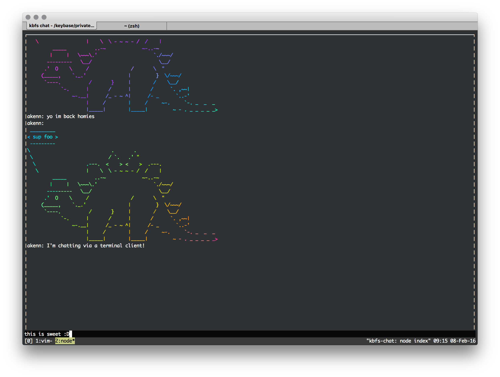

# KBFS Terminal Chat Client
> Use a file in the Keybase File System to chat!



## Install

```
npm install
```

## Run

```
node index.js /path/to/keybase/file
```

## Quit

Press `escape` twice

## Todo

- Either remove `shelljs` and use more secure alternatives or fix areas where shell scripts can be injected (i.e. `node index.js /keybase/file; rm -rf /;`)
- Tidy up code
